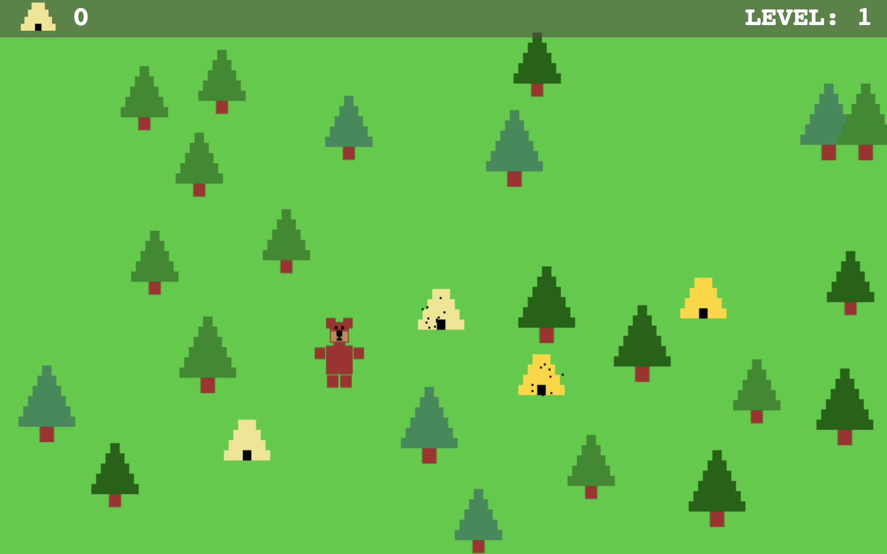

# Bear Life

_Life is not easy when you are a little bear in big world._

### Play for FREE [here](https://kyle-west.github.io/bear-life/).

## Origin story

One day I wanted to build a web game entirely in Vanilla JavaScript. So I did. Now anyone in the whole world can play my game and know what it is like to be a bear and steal honey from angry bees.

<!-- One day I wanted to build a web game entirely in Vanilla JavaScript. So I did. Later I wanted to test out the JS Gamepad API. So I did. Now anyone in the whole world can play my game and know what it is like to be a bear and steal honey from angry bees. -->

## Contributing

If you wish this game was better, feel fork it and send me a pull request. 

Hit me up on Twitter ([@Kyl3W3st](https://twitter.com/Kyl3W3st)) if you have any questions or like my game. 